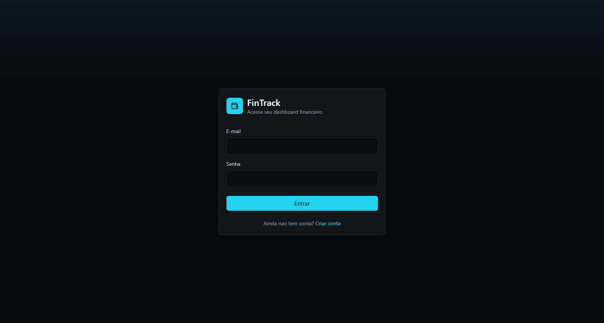
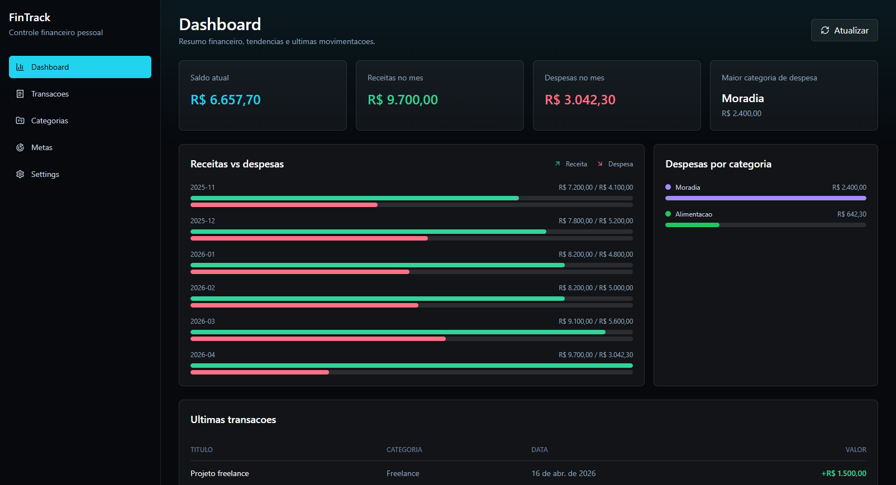
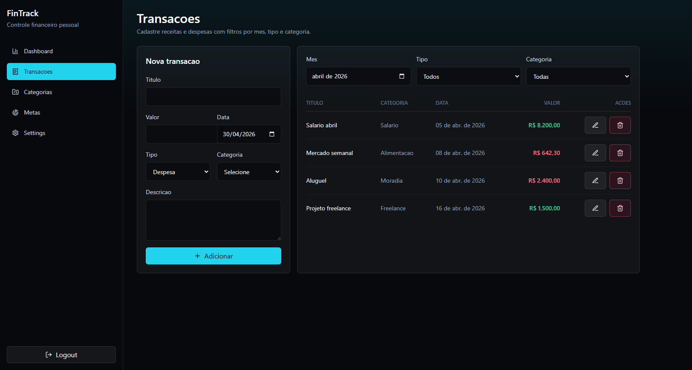
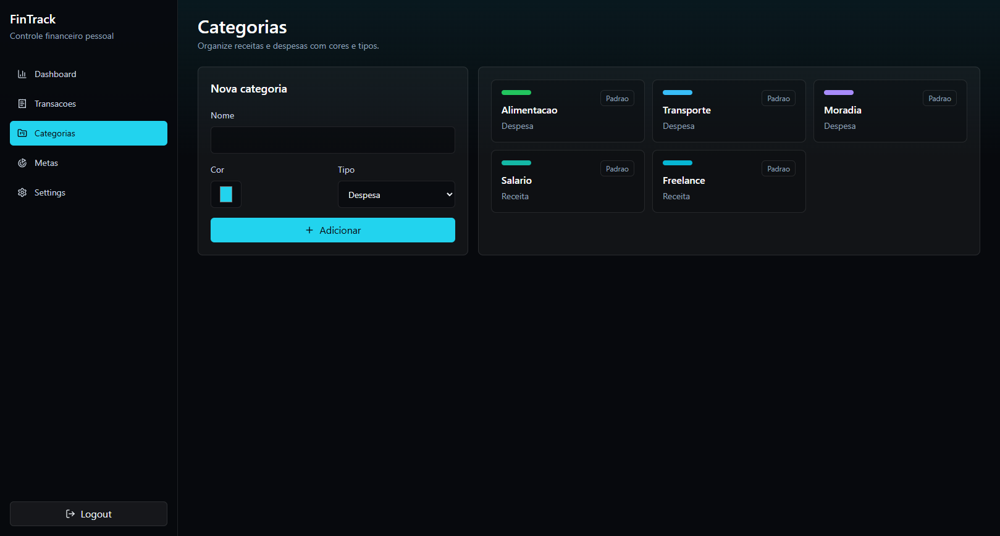
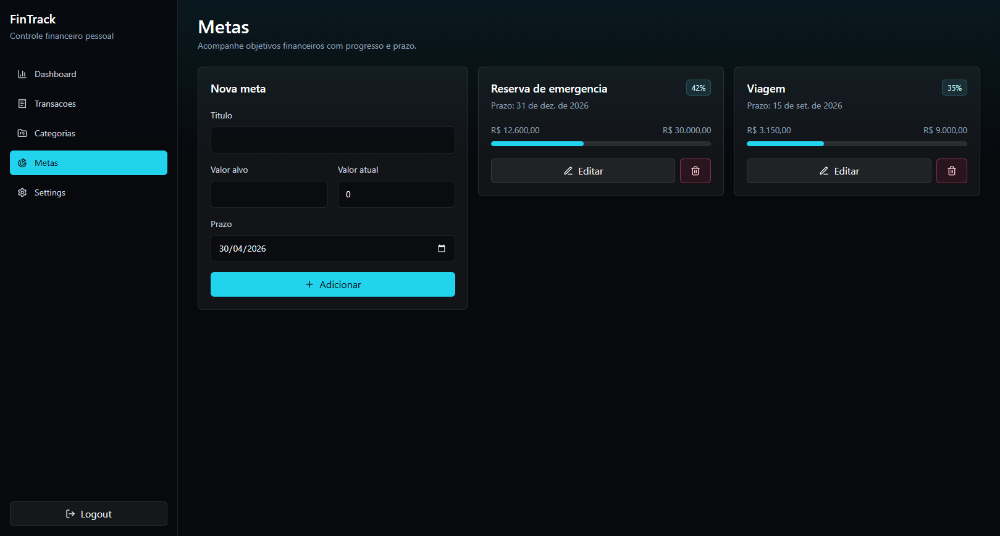
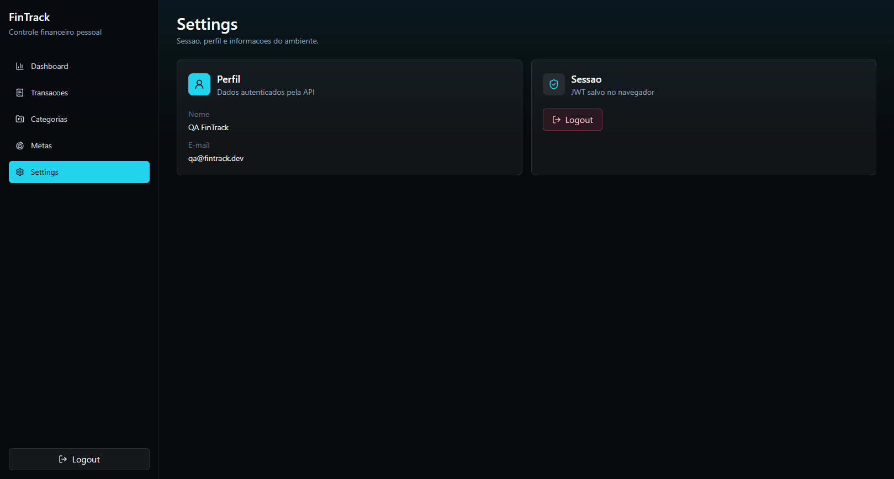

<div align="center">
  <p><a href="./README.md">🇧🇷 Leia em Português</a></p>
  
  

  <br>

  
  
  
  
</div>

---

## 💸 About

**FinTrack** is a personal finance platform designed to help users manage income, expenses, categories, and financial goals with a clean and modern dashboard experience.

The project includes mobile and web interfaces powered by a REST API and a relational database.

<div align="center">
  
  
  <br>
  <em>Authentication and main Dashboard interfaces</em>
</div>

---

## ✨ Features

- User authentication (JWT)
- Income and Expense tracking
- Transaction categories
- Monthly balance and summary
- Financial goals tracking
- Dashboard metrics and charts
- Recent transactions feed
- Filters by type, category, and date
- Protected routes
- API data validation

---

## 🧱 Tech Stack

<div align="center">


</div>

---

## 📱 Screens

```txt
Mobile
├── Login
├── Register
├── Dashboard
├── Transactions
├── New Transaction
├── Categories
├── Goals
└── Profile

Web
├── Dashboard
├── Transactions
├── Categories
├── Goals
└── Settings
```

---

## 🗂️ Project Structure

```txt
fintrack/
├── apps/
│   ├── mobile/
│   ├── web/
│   └── api/
├── packages/
│   └── shared/
├── docker-compose.yml
└── README.md
```

---

## 🚀 Getting Started

Follow the steps below to run the project locally.

### 1. Clone the repository and install dependencies
```bash
git clone https://github.com/odevfigueiredo/fintrack.git
cd fintrack
npm install
```

### 2. Configure Environment Variables
Copy the `.env.example` files to create the active environment files:
```bash
cp apps/api/.env.example apps/api/.env
cp apps/web/.env.example apps/web/.env.local
cp apps/mobile/.env.example apps/mobile/.env
```
*(Note: Be sure to change the credentials in `apps/api/.env` if you run into Prisma permission errors during the next steps).*

### 3. Start the Database
Start the MySQL container using Docker Compose:
```bash
docker compose up -d
```

### 4. Setup Database Schema
Generate the Prisma Client, run migrations, and seed default categories and the test user:
```bash
npm run db:generate
npm run db:migrate
npm run db:seed
```

### 5. Run the Applications
Open separate terminals for each service and start them:
```bash
# Terminal 1 - Start the API Backend
npm run dev:api

# Terminal 2 - Start the Web Dashboard
npm run dev:web

# Terminal 3 - Start the Mobile App
npm run dev:mobile
```

---

## 🔐 Test User

A test user is automatically created when you run the database seed script:
```txt
email: user@fintrack.dev
password: 123456
```

---

## 📌 API Overview

```txt
POST   /auth/register
POST   /auth/login
GET    /auth/me

GET    /transactions
POST   /transactions
GET    /transactions/:id
PUT    /transactions/:id
DELETE /transactions/:id

GET    /categories
POST   /categories
PUT    /categories/:id
DELETE /categories/:id

GET    /goals
POST   /goals
PUT    /goals/:id
DELETE /goals/:id

GET    /dashboard/summary
```

---

## 🧭 Roadmap

- Bank account grouping
- Recurring transactions
- CSV/PDF export
- Budget limits
- Advanced charts
- Offline sync
- Push reminders

---

## 📸 Preview

<div align="center">
  <h3>Transactions</h3>
  

  <br><br>

  <h3>Categories & Goals</h3>
  
  

  <br><br>

  <h3>Settings</h3>
  
</div>

---

<div align="center">

Developed by [Jonatha Figueiredo](https://github.com/odevfigueiredo)


</div>
